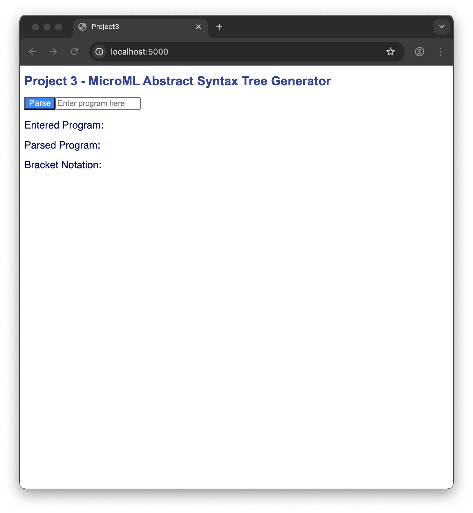
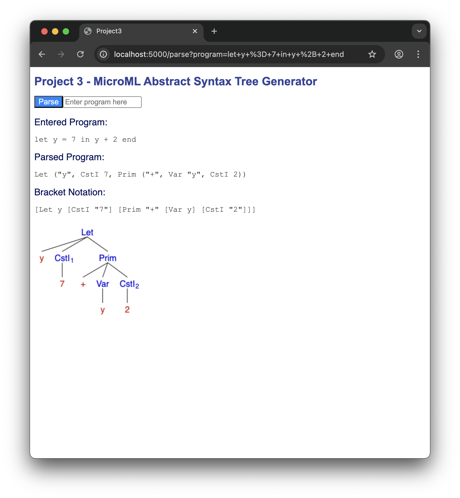

# CS 510 Project 3 - MicroML Abstract Syntax Tree Generator

## License

See [LICENSE](LICENSE) for more information.

## Usage

1. Enter MicroML program in the textbox labeled "Enter program here".
1. Click the button labeled "Parse".
1. The program text that you just entered, the parsed version of that program text, and then the bracket notation of *that* text will be displayed in the appropriate sections.

## Screenshots

Below are screenshots showing the web app on startup and then after entering a program and pressing the Parse button.

